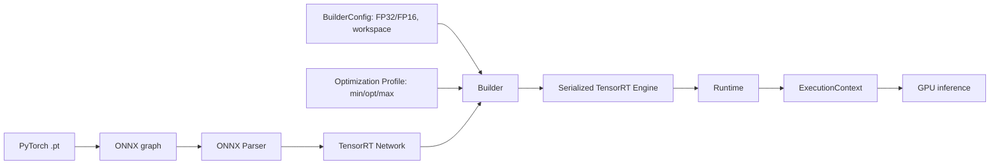

# Day 15 学习记录

日期：2026-07-14

主题：TensorRT 架构、Builder、Parser、Engine 与 Optimization Profile

## 今日目标

- 理解 ONNX 模型如何经过 TensorRT 变成可执行 engine。
- 区分 Builder、Network、Parser、BuilderConfig、Profile、Runtime 和 ExecutionContext。
- 理解 TensorRT engine 为什么与 GPU 架构、TensorRT/CUDA 版本和构建配置相关。
- 在 RTX 4070 + WSL2 中建立独立 TensorRT 10.9 环境，不影响已有环境。
- 用 Python API 解析动态输入的 YOLO11n ONNX，配置 FP16、workspace 和动态 shape profile。
- 今天只检查“能否构建”，Day16 再真正生成 FP32/FP16 engine 并测速。

今天不需要 Jetson。PC 和 Jetson 应分别构建自己的 engine，不能把 RTX 4070 上生成的 x86 engine 直接复制到 Jetson 使用。

## 7 小时安排

| 时间 | 内容 | 产出 |
| ---: | --- | --- |
| 0.5 小时 | 检查 `trt310` 环境，复习 ONNX 动态输入 | 环境检查结果 |
| 1 小时 | 理解 TensorRT 完整工作流 | 架构流程图 |
| 1 小时 | Engine、Builder、Runtime 生命周期 | 组件职责表 |
| 1.5 小时 | 阅读并运行 `trt_builder_check.py` | ONNX 解析和 Profile 检查 |
| 1 小时 | 深入理解 min/opt/max 与 workspace/FP16 | 参数解释与问答 |
| 1 小时 | 梳理 Day16 的 `trtexec` 构建与 benchmark 方法 | Day16 实验设计 |
| 0.5 小时 | 个人竞赛规则检查或 baseline 复盘 | 一条竞赛记录 |
| 0.5 小时 | 复盘、日志和 Git 提交 | Day15 完成记录 |

## 开始前：环境结论

已创建独立 Conda 环境：

```text
trt310
Python 3.10.20
TensorRT 10.9.0.34 (CUDA 12 build)
```

采用 TensorRT 10.9 而不是当前最新的 TensorRT 11，原因是：

- 当前 ONNX Runtime TensorRT EP 文档对应 TensorRT 10.9 与 CUDA 12.x，版本组合更接近现有实验环境。
- Jetson 上是 TensorRT 10.3，PC 使用同一大版本更适合入门和比较 API。
- TensorRT 11 默认面向更新的 CUDA 13 组合，现在切换会增加依赖冲突，却不能提高今天的学习收益。
- `trt310` 与 `deploy310`、`ortgpu310` 完全隔离，旧实验仍可复现。

当前 pip 安装提供 TensorRT Python API 和运行库，但不包含 `trtexec` 与 C++ 头文件。Day16 将单独准备 NVIDIA 官方 tar/deb/container 中的 `trtexec`；若下载条件不合适，则先用同等参数的 Python Builder API 完成 engine 构建。

## 必做 1：确认环境

在 VS Code 的 WSL 终端执行：

```bash
conda activate trt310
cd ~/model-deploy-day09

which python
python --version
python -c "import tensorrt as trt; print('TensorRT:', trt.__version__)"
python -m pip check
```

预期关键结果：

```text
/home/nefelibata/miniconda3/envs/trt310/bin/python
Python 3.10.20
TensorRT: 10.9.0.34
No broken requirements found.
```

如果终端前面不是 `(trt310)`，不要继续运行今天的脚本。

## 必做 2：理解 TensorRT 工作流



### 各组件职责

| 组件 | 作用 | 什么时候使用 |
| --- | --- | --- |
| `Logger` | 接收 TensorRT 警告和错误 | 构建和运行都需要 |
| `OnnxParser` | 把 ONNX 节点转换为 TensorRT Network | 构建阶段 |
| `Network` | TensorRT 内部的计算图 | 构建阶段 |
| `Builder` | 搜索 tactic、融合算子并生成 engine | 离线构建阶段 |
| `BuilderConfig` | 设置精度、workspace 和其他构建选项 | 构建阶段 |
| `OptimizationProfile` | 为动态输入定义 min/opt/max | 动态 shape 构建阶段 |
| `Engine` | 已优化、序列化的推理计划 | 部署产物 |
| `Runtime` | 反序列化 engine | 运行阶段 |
| `ExecutionContext` | 保存实际 shape 和一次推理所需状态 | 每个推理流/线程 |

需要记住：Builder 负责“编译”，Runtime 和 ExecutionContext 负责“执行”。正式部署通常不会在每次启动时重新构建 engine。

## 必做 3：理解 engine 为什么不能跨设备乱用

ONNX 是相对通用的模型图；TensorRT engine 是经过目标设备优化后的二进制执行计划。构建时 TensorRT 会考虑：

- GPU Compute Capability 和具体硬件能力。
- TensorRT、CUDA、驱动和插件版本。
- 输入 shape 与 Optimization Profile。
- FP32、FP16 或 INT8 精度配置。
- tactic 搜索结果、workspace 上限和可用显存。

因此本课程采用：

```text
同一个 yolo11n.onnx
    |-- RTX 4070 上构建 PC engine
    `-- Jetson Orin Nano 上重新构建 Jetson engine
```

不要把 PC 的 `.engine` 当成类似 ONNX 的通用文件。

## 必做 4：运行 Builder/Parser/Profile 检查

脚本位置：

```text
~/model-deploy-day09/scripts/trt_builder_check.py
```

完整代码：

```python
from pathlib import Path

import tensorrt as trt


MODEL_PATH = Path("models/yolo11n.onnx")
WORKSPACE_BYTES = 1 << 30


def shape_tuple(tensor: trt.ITensor) -> tuple[int, ...]:
    return tuple(int(dim) for dim in tensor.shape)


def main() -> None:
    if not MODEL_PATH.exists():
        raise FileNotFoundError(f"model not found: {MODEL_PATH}")

    logger = trt.Logger(trt.Logger.ERROR)
    builder = trt.Builder(logger)
    network = builder.create_network(0)
    parser = trt.OnnxParser(network, logger)

    if not parser.parse(MODEL_PATH.read_bytes()):
        errors = [
            str(parser.get_error(index))
            for index in range(parser.num_errors)
        ]
        raise RuntimeError("ONNX parse failed:\n" + "\n".join(errors))

    config = builder.create_builder_config()
    config.set_memory_pool_limit(
        trt.MemoryPoolType.WORKSPACE,
        WORKSPACE_BYTES,
    )

    precision = "FP32"
    if builder.platform_has_fast_fp16:
        config.set_flag(trt.BuilderFlag.FP16)
        precision = "FP16 enabled"

    profile = None
    for index in range(network.num_inputs):
        tensor = network.get_input(index)
        if -1 in shape_tuple(tensor):
            if profile is None:
                profile = builder.create_optimization_profile()

            profile.set_shape(
                tensor.name,
                min=(1, 3, 320, 320),
                opt=(1, 3, 640, 640),
                max=(1, 3, 960, 960),
            )

    if profile is not None:
        config.add_optimization_profile(profile)

    print("TensorRT:", trt.__version__)
    print("model:", MODEL_PATH)
    print("layers:", network.num_layers)

    print("inputs:")
    for index in range(network.num_inputs):
        tensor = network.get_input(index)
        print(
            f"- {tensor.name} "
            f"shape={shape_tuple(tensor)} "
            f"dtype={tensor.dtype}"
        )

    print("outputs:")
    for index in range(network.num_outputs):
        tensor = network.get_output(index)
        print(
            f"- {tensor.name} "
            f"shape={shape_tuple(tensor)} "
            f"dtype={tensor.dtype}"
        )

    print("workspace bytes:", WORKSPACE_BYTES)
    print("precision:", precision)
    print(
        "optimization profile:",
        "configured" if profile else "not required",
    )
    print("engine build: skipped on Day15")


if __name__ == "__main__":
    main()
```

运行：

```bash
python scripts/trt_builder_check.py
```

本机已验证的结果：

```text
TensorRT: 10.9.0.34
model: models/yolo11n.onnx
layers: 775
inputs:
- images shape=(-1, 3, -1, -1) dtype=DataType.FLOAT
outputs:
- output0 shape=(-1, 84, -1) dtype=DataType.FLOAT
workspace bytes: 1073741824
precision: FP16 enabled
optimization profile: configured
engine build: skipped on Day15
```

注意：ONNX 中看到的网络层数和 TensorRT Parser 解析后的层数不必相同。Parser 会把 ONNX 运算拆解或映射为 TensorRT 的内部表示；最终 Builder 还会继续融合和优化。

## 必做 5：理解动态 Profile

当前模型输入为：

```text
(-1, 3, -1, -1)
```

`-1` 代表动态维度，所以构建 engine 前必须告诉 TensorRT 允许的范围：

```python
profile.set_shape(
    "images",
    min=(1, 3, 320, 320),
    opt=(1, 3, 640, 640),
    max=(1, 3, 960, 960),
)
```

- `min`：engine 接受的最小输入，低于它不能执行。
- `opt`：最常用的输入，TensorRT 会重点针对它选择 tactic；本项目最常用 640。
- `max`：engine 接受的最大输入，会影响构建耗时和显存规划。

Profile 不是“自动把图片缩放成这些大小”。OpenCV/预处理仍要生成符合范围的 tensor，并在运行前给 ExecutionContext 指定实际 shape。

范围也不是越大越好。过宽的 min/max 可能增加构建时间、engine 体积、显存规划复杂度，并使某些 shape 的最优性能变差。

## 必做 6：理解 FP16 与 workspace

### FP16

```python
config.set_flag(trt.BuilderFlag.FP16)
```

这表示允许 TensorRT 使用 FP16 tactic，不代表所有层都一定强制使用 FP16。TensorRT 会根据支持情况、性能和精度约束选择合适实现。

### Workspace

```python
config.set_memory_pool_limit(
    trt.MemoryPoolType.WORKSPACE,
    1 << 30,
)
```

这里是 1 GiB。它限制 Builder/算子 tactic 可使用的 workspace，不等于 engine 文件大小，也不等于程序运行时显存的总上限。workspace 太小可能排除更快的 tactic；太大也不会自动让模型变快。

## 必做 7：为 Day16 设计公平实验

明天将对同一 ONNX、同一图片和同一输入尺寸构建并比较：

```text
TensorRT FP32 engine
TensorRT FP16 engine
```

统一记录：

| 项目 | FP32 | FP16 |
| --- | ---: | ---: |
| engine 大小 | 待测 | 待测 |
| build 时间 | 待测 | 待测 |
| mean latency | 待测 | 待测 |
| P50 | 待测 | 待测 |
| P95 | 待测 | 待测 |
| FPS | 待测 | 待测 |

公平比较要求：

- 模型、输入 tensor、输入尺寸和 batch 相同。
- warmup 次数和正式测试次数相同。
- 明确记录是纯 inference 还是完整 pipeline。
- 不用单次最快值代替稳定统计结果。
- 结果中注明 PC 的 GPU、TensorRT 和 CUDA 版本。

## 必做 8：回答检查题

1. ONNX 和 TensorRT engine 的可移植性有什么区别？
2. Builder 和 Runtime 分别负责什么？
3. 动态输入模型为什么必须设置 Optimization Profile？
4. `opt=(1,3,640,640)` 是否意味着只能输入 640？
5. 开启 FP16 是否意味着每一层都必然使用 FP16？
6. 1 GiB workspace 是否等于 engine 会占 1 GiB 显存？
7. 为什么 Jetson 上必须重新构建 engine？

能够用自己的话回答这些问题，才算掌握 Day15，而不是只把脚本运行成功。

## 个人竞赛 30 分钟

二选一完成即可：

- 回看 Kaggle Digit Recognizer 首次提交，记录模型、验证方式、线上分数和一个可执行的改进点。
- 阅读已报名天池视觉赛题的参赛资格、提交格式和截止日期，只记录事实，不在今天开启重训练。

竞赛记录应写入 `career/competition-shortlist-2026-summer.md` 或当天完成记录，避免只报名不跟进。

## 常见错误

### 1. `ModuleNotFoundError: No module named 'tensorrt'`

通常是终端仍在 `base`、`deploy310` 或 `ortgpu310`：

```bash
conda activate trt310
which python
python -c "import tensorrt as trt; print(trt.__version__)"
```

### 2. Parser 报错

不要只看最后一行。脚本会遍历 `parser.num_errors`，应检查不支持的 ONNX 节点、opset、插件或 shape。

### 3. 动态输入没有 Profile

如果输入中存在 `-1`，但 BuilderConfig 没有 Optimization Profile，真正构建 engine 时会失败。

### 4. 把 `platform_has_fast_fp16` 当成 engine 已构建成功

它只说明硬件支持快速 FP16。今天仍然没有调用 `build_serialized_network`，所以不会生成 `.engine`。

### 5. 找不到 `trtexec`

pip 的 Python wheel 不保证附带 `trtexec`。它通常来自 TensorRT tar/deb/container 完整发行包，Day16 单独处理。

## 今日产出清单

```text
独立 Conda 环境：trt310
TensorRT 10.9.0.34 Python API
scripts/trt_builder_check.py
TensorRT 工作流图
动态 Profile 与 FP16/workspace 解释
Day16 FP32/FP16 实验设计
```

## 今日完成情况

- [x] 建立独立 `trt310` 环境，不影响已有环境。
- [x] TensorRT 10.9 Python API、Builder 和 FP16 能力检查通过。
- [x] YOLO11n ONNX Parser 和动态 Profile 检查通过。
- [ ] 能用自己的话解释 TensorRT 工作流和各组件职责。
- [ ] 完成七道检查题。
- [ ] 完成 30 分钟个人竞赛记录。
- [ ] 完成 Day15 复盘。

## 已遇到的问题

- 最新 TensorRT pip 依赖体积很大，而且最新版默认版本组合与当前 ORT/Jetson 教学链不完全一致。
- 最初直接使用 pip 下载时，中断后需要重新处理大文件。最终改为可续传下载、校验 SHA256，再从本地 wheel 安装。
- TensorRT Python wheel 不包含 `trtexec`，Python API 与完整 SDK 工具需要分开理解。

## 参考资料

- [NVIDIA TensorRT pip 安装文档](https://docs.nvidia.com/deeplearning/tensorrt/latest/installing-tensorrt/install-pip.html)
- [NVIDIA TensorRT 安装方式说明](https://docs.nvidia.com/deeplearning/tensorrt/latest/installing-tensorrt/installing.html)
- [NVIDIA TensorRT 前置条件](https://docs.nvidia.com/deeplearning/tensorrt/latest/installing-tensorrt/prerequisites.html)
- [ONNX Runtime TensorRT Execution Provider](https://onnxruntime.ai/docs/execution-providers/TensorRT-ExecutionProvider.html)

## 明日计划

- Day16 准备 `trtexec` 或等价 Python Builder 构建入口。
- 分别构建 TensorRT FP32 与 FP16 engine。
- 记录 build 时间、engine 大小，并运行统一 benchmark。
- 不使用 Jetson，继续在 RTX 4070 + WSL2 完成 PC 端实验。
